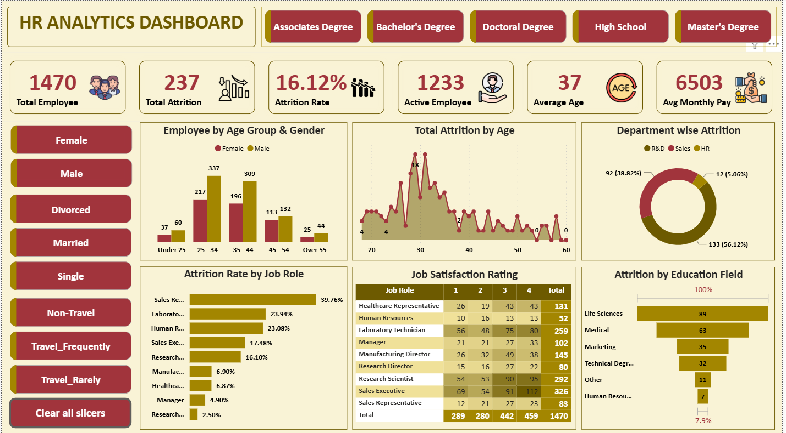

# HR Analytics Dashboard (Power BI)

## Overview

This project presents an interactive HR Analytics Dashboard developed in Microsoft Power BI to analyze employee attrition, workforce demographics, job satisfaction, and departmental performance.

The dashboard helps HR teams understand employee behavior and make data-driven decisions through interactive visualizations and KPI tracking.

---

## Dashboard Preview

## Key KPIs

- Total Employees
- Active Employees
- Total Attrition
- Attrition Rate
- Average Age
- Average Monthly Salary

---

## Dashboard Features

### Employee Analysis

- Employee by Age Group
- Gender Distribution
- Marital Status Filters
- Education Filters
- Travel Status Filters

### Attrition Analysis

- Attrition by Department
- Attrition by Job Role
- Attrition by Education Field
- Attrition Trend by Age

### Employee Satisfaction

- Job Satisfaction Rating
- Department-wise Comparison

---

## Tools Used

- Microsoft Power BI
- Power Query
- DAX
- Data Visualization

---

## Skills Demonstrated

- Data Cleaning
- ETL Process
- Dashboard Design
- KPI Development
- Interactive Reporting
- DAX Measures
- HR Data Analytics

---

## Project Insights

- Overall employee attrition rate is 16.12%.
- R&D department contributes the highest employee attrition.
- Employees aged 25–34 represent the largest workforce segment.
- Life Sciences has the highest attrition among education fields.
- Sales Representatives experience the highest attrition by job role.

---

## Files Included

- Power BI Dashboard (.pbix)
- Dataset
- Dashboard Screenshot
- Project Documentation

---

## Author

**Kaleem Asharaf**

Aspiring Data Analyst | Power BI | Excel | SQL | Data Visualization

Connect with me on LinkedIn.
